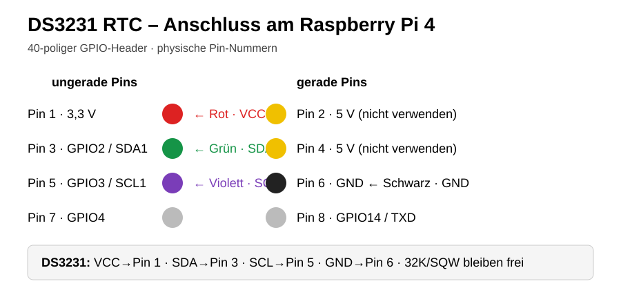

# DAB Touchscreen – Raspberry-Pi-HMI für 3‑Phasen-PFC + DAB

Touch-HMI für Raspberry Pi 4 mit offiziellem 7-Zoll-Raspberry-Pi-Touchdisplay. Verbindliche Referenzauflösung: **800×480 Pixel im Querformat**. Das System visualisiert dreiphasige PFC, Zwischenkreis und DAB, empfängt Betriebsdaten über MQTT und stellt einen lokalen MQTT-Broker bereit.


### Hardware-Teststatus WLAN/Firmware

Auf Raspberry Pi 4 mit NetworkManager getestet: Die gewählte Firmware-Branch bleibt über Updates gespeichert, WLAN kann nach manuellem Trennen über das gespeicherte NetworkManager-Profil ohne erneute Passworteingabe verbunden werden, und der WLAN-Hauptschalter funktioniert. Auch die Wiederherstellung des ausgeschalteten WLAN-Hauptschalters über ein Firmware-Update wurde auf der Zielhardware erfolgreich validiert. Beim Laden der Werkseinstellungen bleiben LAN-/WLAN-Konfiguration und der aktuelle WLAN-Hauptschalterzustand unverändert; zurückgesetzt werden nur anwendungseigene Einstellungen.

## Hauptnavigation

Die tatsächlich implementierte und verbindliche Hauptnavigation lautet:

`Übersicht | Verläufe | MQTT Explorer | ⚙ Einstellungen`

Beim Öffnen von **⚙ Einstellungen** wird die Hauptleiste ersetzt durch:

`Netzwerk (LAN) | WLAN | System | ← Zurück`

Die beiden Navigationsebenen werden nicht gleichzeitig angezeigt.

### Übersicht

Schematischer Energiefluss Netz → PFC → Zwischenkreis → DAB → DC-Ausgang sowie Messwerte und Temperaturen.


### Verläufe

Zeitreihen mit Touch-Zoom/Pan und auswählbaren Zeitbereichen.


### MQTT Explorer

Topic-Baum und MQTT-Nachrichten einschließlich Payload, Zeitstempel, QoS und Retain.


### ⚙ Einstellungen

**Netzwerk (LAN):** Ethernet-Konfiguration und lokaler MQTT-Broker.


**WLAN:** SSID-Scan, Verbindung, Signalstärke und IP-Adresse.


**System:** CPU-Auslastung, Arbeitsspeicher, CPU-Temperatur, Datenträgerbelegung, Laufzeit, Hostname, Betriebssystem und aktive IP-Adressen. Neustart und Ausschalten nur nach Sicherheitsabfrage.

## Echtzeituhr (RTC)

Für eine korrekte Uhrzeit auch ohne Netzwerk/NTP wird eine batteriegepufferte **DS3231 RTC** am I²C-Bus empfohlen. Die Firmware aktiviert I²C dauerhaft und bindet die RTC beim Start ein. Damit stehen korrekte Zeitstempel für MQTT, Verläufe und Systemprotokolle auch nach einem netzlosen Neustart zur Verfügung.

### Anschluss am Raspberry Pi 4

| DS3231 | Kabelfarbe | Raspberry Pi 4 |
|---|---|---|
| VCC | Rot | **Pin 1 – 3,3 V** |
| SDA | Grün | **Pin 3 – GPIO2 / SDA1** |
| SCL | Violett | **Pin 5 – GPIO3 / SCL1** |
| GND | Schwarz | **Pin 6 – GND** |

`32K` und `SQW` bleiben unbeschaltet. Das RTC-Modul wird mit **3,3 V** betrieben; die 5-V-Pins 2 und 4 werden hierfür nicht verwendet.



Nach Installation bzw. Firmwareupdate einmal neu starten. Anschließend lässt sich die Hardware prüfen mit:

```bash
ls -l /dev/i2c-1
sudo i2cdetect -y 1
ls -l /dev/rtc*
sudo hwclock --show
```

Beim I²C-Scan muss der DS3231 unter **Adresse `0x68`** erscheinen. Bei Modulen mit zusätzlichem EEPROM kann außerdem **`0x57`** sichtbar sein.

## UI-Technik

Empfohlene/reale Zielarchitektur: Python mit PySide6 oder PyQt6; PyQtGraph für Verläufe. Styling über QSS. Die SVG-Dateien in `docs/images/` sind Design-Mock-ups und keine Screenshots eines anderen Frameworks. Deshalb können sie glatter/eleganter wirken als die derzeitige reale GUI. Ziel ist, die reale Qt-Oberfläche optisch an die Mock-ups anzunähern, ohne Seiteninhalte zu verändern.

Die Mock-ups wurden überwiegend mit `Arial`/`sans-serif` beschrieben. Für die reale Raspberry-Pi-GUI wird in `UI_SPEC.md` eine auf dem System verfügbare Qt/Linux-Schriftfamilie samt Fallback festgelegt, damit Mock-up und reale Darstellung reproduzierbar zusammenpassen.

## Wichtige Vorgaben

- 800×480 ist die verbindliche Referenz; 1024×600 ist keine Designgrundlage mehr.
- Bestehende Seiteninhalte nicht allein wegen der Auflösungsanpassung verändern.
- Haupt-/Untermenüstruktur entspricht der realen Implementierung.
- MQTT-Topics zentral mappen.
- MQTT-/Netzwerkoperationen dürfen die GUI nicht blockieren.
- NetworkManager für Netzwerkänderungen verwenden.
- Secrets ausschließlich lokal speichern und niemals in Git committen.
- Bildschirmtastatur darf das aktive Eingabefeld nicht verdecken.

Weitere Details: [`UI_SPEC.md`](UI_SPEC.md), [`ARCHITECTURE.md`](ARCHITECTURE.md), [`PROJECT_PROMPT.md`](PROJECT_PROMPT.md), [`COMMISSIONING.md`](COMMISSIONING.md).

## Raspberry-Pi-Implementierung und Wiederherstellung

Die eigenständig installierbare, auf dem Zielgerät geprüfte Implementierung liegt
unter [`raspberry-pi/`](raspberry-pi/). Sie enthält Anwendung, Konfiguration,
Installations-, Aktualisierungs- und Deinstallationsskripte sowie die benötigten
systemd-, Display-, Touch-, Kiosk-, Netzwerk- und MQTT-Dateien.

- Installation auf einem frischen Raspberry Pi OS:
  [`raspberry-pi/README.md`](raspberry-pi/README.md)
- Arbeiten mit GitHub, Aktualisierung und Wiederherstellung bekannter Stände:
  [`raspberry-pi/GIT_WORKFLOW.md`](raspberry-pi/GIT_WORKFLOW.md)
- Ungefährliche Vorlage für lokale Zugangsdaten:
  [`raspberry-pi/secrets.env.example`](raspberry-pi/secrets.env.example)

Normales Update nach einem Merge in `main`:

```bash
cd ~/dab-touchscreen && git pull --ff-only origin main && sudo ./raspberry-pi/update.sh
```

`update.sh` überspringt die Installation von Systempaketen. Weist eine Version
neue oder geänderte Paketabhängigkeiten aus, ist stattdessen
`sudo ./raspberry-pi/install.sh` auszuführen. Der integrierte versionsbewusste Firmware-Updater unterstützt Main- und TEST-Branch, merkt sich die gewählte Branch, sichert Netzwerkzustände und führt bei Fehlern ein Rollback aus. Der WLAN-Hauptschalterzustand wird über Firmware-Updates hinweg erhalten. Die Trennung von Repository, lokalen Secrets und Laufzeitdaten bleibt dabei bestehen.

Echte Laufzeitdaten und Zugangsdaten bleiben lokal und werden durch die
Ignore-Regeln ausgeschlossen. Historische, inzwischen abgelöste
Migrationshelfer sind nur zur Nachvollziehbarkeit unter
[`archive/legacy-runtime/`](archive/legacy-runtime/) abgelegt.
