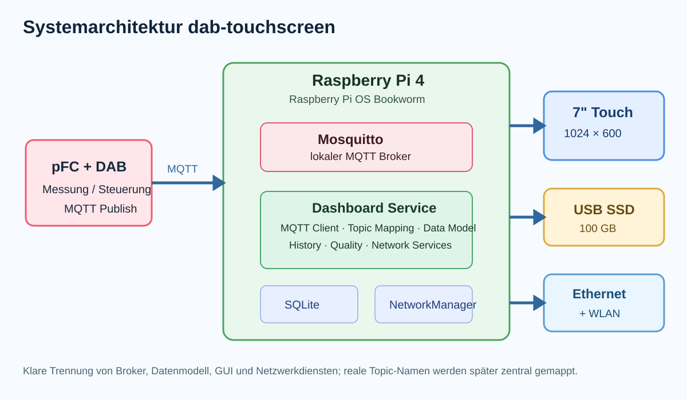
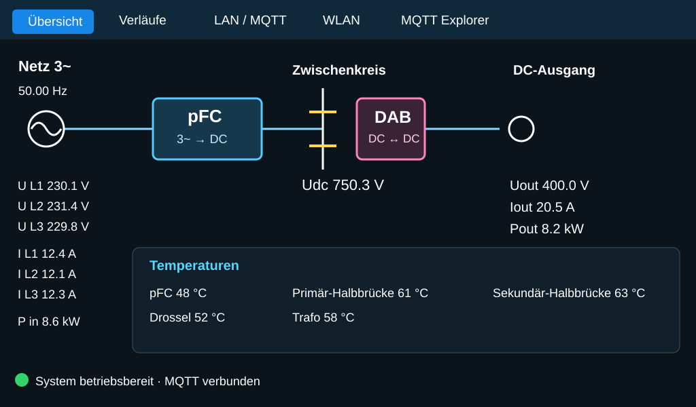
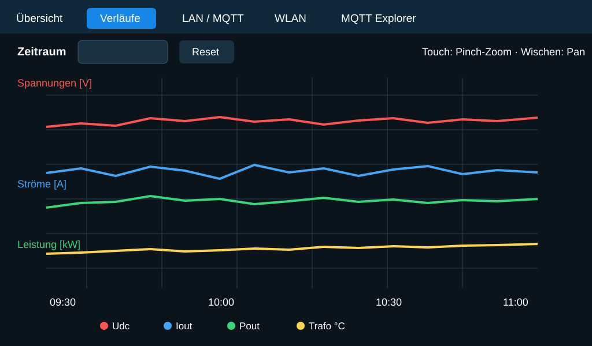
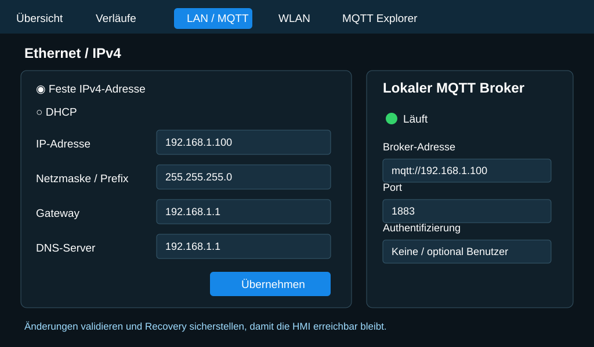
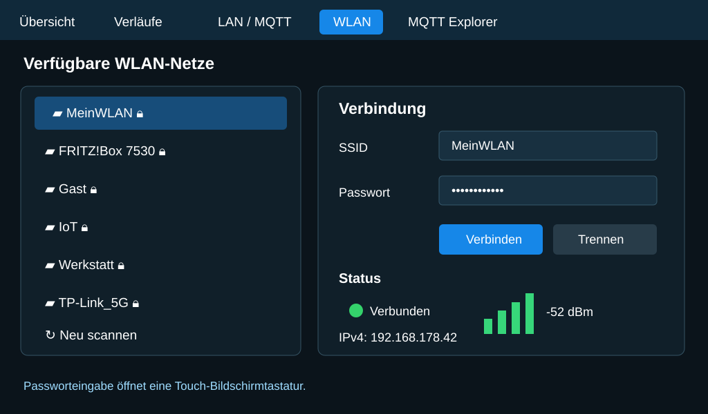
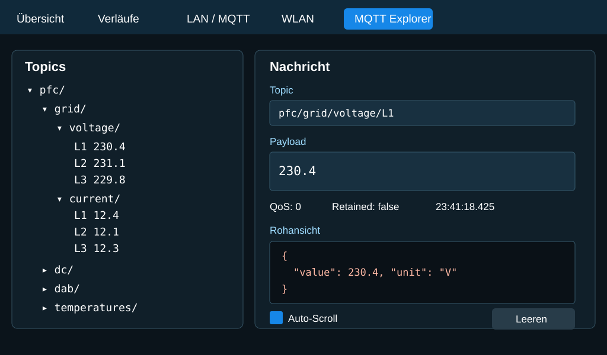

# DAB Touchscreen – Raspberry-Pi-HMI für 3‑Phasen-PFC + DAB

Dieses Repository beschreibt und implementiert eine Touch-HMI für einen Raspberry Pi 4 mit 7‑Zoll-Display. Das System visualisiert eine dreiphasige PFC mit nachgeschaltetem Dual Active Bridge (DAB), empfängt Betriebsdaten über MQTT und stellt selbst einen lokalen MQTT-Broker bereit.

## Zielhardware

- Raspberry Pi 4
- 7‑Zoll-Touchdisplay, Zielauflösung zunächst 1024×600
- 100‑GB-SSD über USB, später dauerhaft am Raspberry Pi
- Ethernet und WLAN
- lokaler MQTT-Broker

## Systemarchitektur

Die detaillierte Architektur, der vorgeschlagene Software-Stack, die Modultrennung und die Ziel-Verzeichnisstruktur stehen in [`ARCHITECTURE.md`](ARCHITECTURE.md).

## Hauptansichten

### 1. Übersicht / Live-Daten

Schematischer Energiefluss Netz → 3‑Phasen-PFC → Zwischenkreis → DAB → DC-Ausgang sowie die wichtigsten Messwerte und Temperaturen.

### 2. Verläufe

Zeitreihen aller Messwerte, sinnvoll gruppiert auf mehrere Y-Achsen, Touch-Zoom/Pan und auswählbare Zeitbereiche.

### 3. LAN / MQTT

Ethernet-Konfiguration einschließlich DHCP/fester IPv4-Adresse sowie Konfiguration und Status des lokalen MQTT-Brokers.

### 4. WLAN

Scan verfügbarer SSIDs, Auswahl per Liste, Passworteingabe über Bildschirmtastatur, Signalstärke und aktuelle WLAN-IP.

### 5. MQTT Explorer

Topic-Baum und eingehende MQTT-Nachrichten möglichst ähnlich zu MQTT Explorer, inklusive Topic, Payload, Zeitstempel, QoS und Retain-Status.

## Dokumente

- `PROJECT_PROMPT.md` – ausführlicher Arbeitsauftrag für OpenClaw
- `REQUIREMENTS.md` – funktionale und technische Anforderungen
- `MQTT.md` – vorläufiges MQTT-Datenmodell und Vorgehen zur späteren Topic-Zuordnung
- `OPEN_QUESTIONS.md` – noch zu klärende Punkte
- `UI_SPEC.md` – Display- und Bedienkonzept
- `ARCHITECTURE.md` – Softwarearchitektur, Komponenten, Datenfluss und Ziel-Verzeichnisstruktur
- `docs/images/*.svg` – visuelle Referenz für alle fünf Display-Reiter und die Systemarchitektur

## Wichtige Architekturvorgaben

- MQTT-Topics zentral mappen und nicht direkt in der GUI verteilen.
- Empfang, Datenmodell und Darstellung voneinander trennen.
- Fehlende oder zu alte Werte als `missing` bzw. `stale` kennzeichnen.
- MQTT-Reconnect und Broker-Ausfall dürfen die Touch-Oberfläche nicht blockieren.
- Netzwerkkonfiguration über NetworkManager kapseln.
- Anwendung und Broker über systemd starten und überwachen.
- Einen MQTT-Simulator für die Entwicklung ohne angeschlossenen Leistungsteil vorsehen.

Die exakten MQTT-Topic-Namen und Payload-Formate werden in einem zweiten Schritt anhand der realen MQTT-Explorer-Darstellung festgelegt. Die Software soll deshalb Topic-Mappings konfigurierbar halten und nicht hart in der GUI verteilen.
